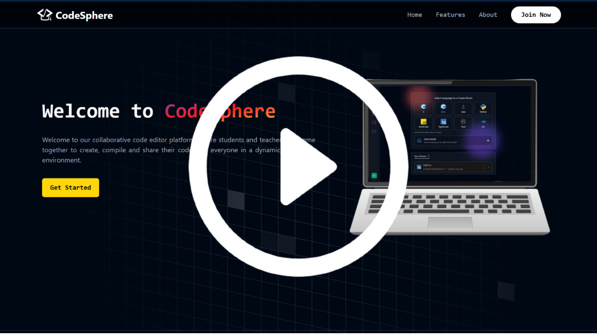

# **CodeSphere - Your Classroom, Compiler, and Community in One Place** 

**CodeSphere** is a comprehensive web platform where users can code, compile, chat, and share their screens seamlessly. Designed to empower collaborative learning, CodeSphere is perfect for teachers and students to conduct live coding classes, interact, and learn together in real-time.

---

## 🚀 Features  
- **Collaborative Coding**: Code together in multiple programming languages like C, C++, Java, Python, and more.  
- **Real-Time Compilation**: Compile each other's code and share feedback instantly.  
- **Screen Sharing**: Share your screen for live demonstrations and debugging sessions.  
- **Chat Integration**: Chat with participants in real-time.  
- **Room Management**:  
  - Create rooms for specific languages.  
  - Share unique Room IDs for participants to join.  
- **Local Save**: Save your code locally on your device.  

---

---
## 🎬 Demo Video

Watch the application in action:

[](https://drive.google.com/file/d/1YFLinRHuZhYKxT1roxqG5dULBIevuiMf/view?usp=sharing)

*Click the image above to watch the demo video*

---


## 💻 Tech Stack  
### Frontend:  
- React.js  
- Tailwind CSS  
- Monaco Code Editor  
- ShadCN (UI Components)  

### Backend:  
- Express.js  
- MongoDB
- Socket.io

### Additional Libraries:  
- Axios  

---

## 🚀 **Installation and Setup**
1. Clone the repository:
   ```bash
   git clone https://github.com/Sagargupta028/CodeSphere.git

2. Navigate into the project directory:
   ```bash
   cd code-sphere

3. Run Frontend:  
   ```bash
   cd frontend
   npm install
   npm run dev

4. Run Backend:
   ```bash
   cd backend
   npm install
   node --watch index.js

5. Access the App:
   Open your browser and navigate to http://localhost:5173 to view the application.

---   


## 📝 Usage

1. **Sign Up & Log In**:  
   After cloning and setting up the project, sign up or log in to your account.

2. **Create a Room**:  
   - Once logged in, create a new room by selecting a programming language (e.g., C, C++, Java, Python, etc.).
   - You can invite others to join by sharing the unique Room ID.

3. **Collaborative Coding**:  
   - Once inside the room, you and your participants can code together in real-time.
   - Use the Monaco code editor for writing your code.

4. **Compile Code**:  
   - You can compile your code directly within the room, and others can compile their code too.

5. **Chat and Screen Share**:  
   - Use the built-in chat feature to discuss and collaborate on code.
   - Share your screen for live demonstrations or troubleshooting.

6. **Save Your Work**:  
   - You can save your code locally to your device for future reference.

